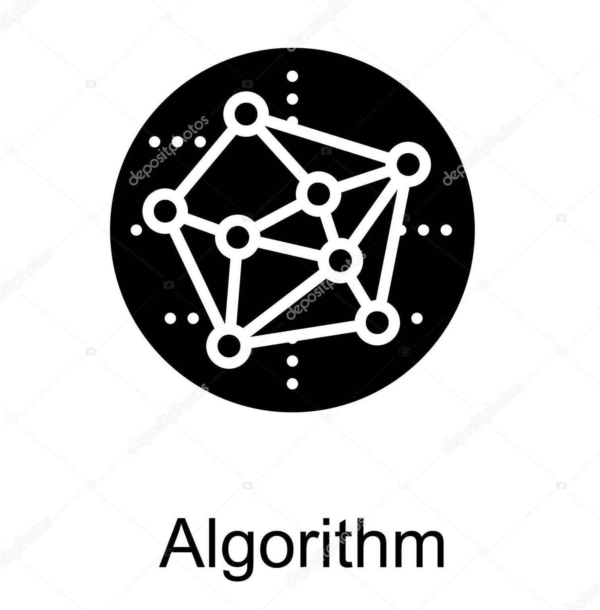

#数据结构与算法(Java描述)
#### Algorithm
- 算法实例：缓存算法、洗牌算法、雪花算法、排序算法
- leetcode：算法题
- 算法思想：递归、回溯、分治、贪心、动态规划
#### Data Structure
- 数组、稀疏数组
- 布隆过滤器
- 图(邻接表、最小生成树、最短路径算法)
- 二叉堆
- 顺序表、链表、跳表
- 哈希map、有序map、链式map
- 顺式队列、链式队列、优先级队列
- 顺式栈、链式栈
- 字符串(模式匹配算法)
- 二叉搜索树、AVL树、红黑树、字典树
- 并查集

